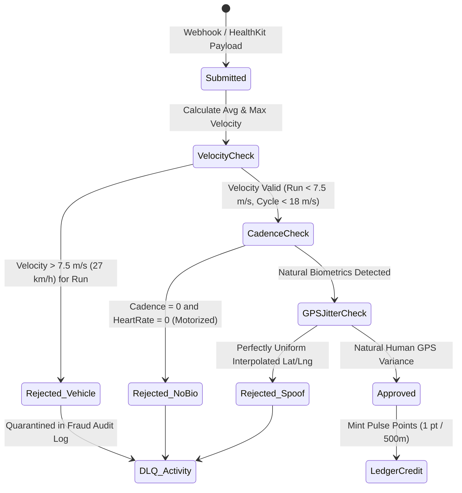

# PulseFit — Technical Architecture & System Design

PulseFit is a unified endurance sports platform combining **autonomous multi-source event calendar discovery**, **biometric wearable activity ingestion (Strava & Apple HealthKit)**, **real-time anti-fraud verification**, and an **immutable double-entry reward ledger**.

---

## 1. Executive System Flowchart (The Core Loop)

PulseFit solves the fragmentation of Indian endurance sports by connecting daily athletic training directly to discounted marathon & brevet registrations:

```mermaid
flowchart TD
    subgraph "1. Wearable Ingestion"
        A[Apple Watch / HealthKit] -->|JSON Payload| W[Webhook Ingestion Gateway]
        B[Strava Cloud] -->|OAuth Event Stream| W
        C[Garmin / Coros] -->|Activity Sync| W
    end

    subgraph "2. Biometric Anti-Fraud Engine"
        W --> V{Rule-Based Fraud Filter}
        V -->|Speed > 7.5 m/s or Vehicle Pace| RJ[Dead Letter / Rejected Activity]
        V -->|Missing Cadence / Zero Heart Rate| FL[Flagged for Manual Review]
        V -->|Biometrically Validated| AP[Approved Activity]
    end

    subgraph "3. Immutable Reward Ledger"
        AP --> L[Double-Entry Ledger Engine]
        L -->|Credit 1 Pt / 500m| UB[User Pulse Balance]
        L -->|Audit Entry| LD[SQLite WAL Ledger DB]
    end

    subgraph "4. Multi-Source Autonomous Lakehouse"
        T[Townscript Worker] --> BZ[(Lakehouse Bronze)]
        I[IndiaRunning Worker] --> BZ
        R[Audax Brevets Worker] --> BZ
        BZ --> SV[(Lakehouse Silver: Normalized)]
        SV --> ED[Entity Dedup Arbiter]
        ED --> GD[(Lakehouse Gold: Canonical Events)]
    end

    subgraph "5. Production UI & Commerce"
        GD --> MP[Leaflet Event Radar Map]
        GD --> CL[Event Calendar View]
        UB --> RD[Bib Subsidy Slider - up to 50% off]
        MP --> REG[1-Click Subsidized Registration]
        CL --> REG
    end

    style W fill:#1f2937,stroke:#00f59b,stroke-width:2px
    style V fill:#1f2937,stroke:#ffd000,stroke-width:2px
    style AP fill:#064e3b,stroke:#00f59b,stroke-width:2px
    style L fill:#1f2937,stroke:#00d2ff,stroke-width:2px
    style GD fill:#0f172a,stroke:#ffd000,stroke-width:2px
    style MP fill:#0f172a,stroke:#00f59b,stroke-width:2px
```

---

## 2. Hub-and-Spoke Sub-Agent Autonomous Scraper Pipeline

To continuously discover endurance events across **Chennai, Bengaluru, Coimbatore, and nationwide**, PulseFit deploys a distributed hub-and-spoke agent architecture governed by [`AGENTS.md`](../AGENTS.md):

```mermaid
graph TD
    subgraph "Lead Orchestration"
        ORCH[Data Engineering Orchestrator<br/>• Pipeline Dispatch<br/>• Schema Enforcement<br/>• Anomaly Detection]
    end

    subgraph "Targeted Worker Sub-Agents"
        ORCH -->|Dispatch Crawl Sweep| W_TS[Townscript Worker<br/>Internal Search API Reverse-Eng<br/>Rate: 2 req/sec]
        ORCH -->|Dispatch Official Calendars| W_IR[IndiaRunning Worker<br/>Procam / TCS / TMM Feeds<br/>Bib & Cutoff Extraction]
        ORCH -->|Dispatch Long-Distance Cycling| W_BR[Brevet / Audax Worker<br/>AIR Homologation Feeds<br/>200K - 1000K Brevets]
    end

    subgraph "Medallion Data Lakehouse"
        W_TS -->|Raw JSON + SHA256| BRONZE[(Bronze Lakehouse<br/>Immutable Scrape Archive)]
        W_IR -->|Raw JSON + SHA256| BRONZE
        W_BR -->|Raw JSON + SHA256| BRONZE

        BRONZE -->|Zod Validation & Normalization| SILVER[(Silver Lakehouse<br/>Typed Dates, INR, Geocodes)]
        BRONZE -.->|Invalid Schema| DLQ[(Dead Letter Queue<br/>lakehouse_dlq)]
    end

    subgraph "Entity Resolution & Production"
        SILVER --> ARB[Entity Dedup Arbiter<br/>• Pass 1: Date ±24h + Geohash<br/>• Pass 2: Jaro-Winkler Title Match<br/>• Pass 3: Multi-Ticket Merge]
        ARB --> GOLD[(Gold Lakehouse<br/>Canonical Event Registry)]
        GOLD --> API[REST API /api/events]
    end

    style ORCH fill:#0f172a,stroke:#00f59b,stroke-width:3px
    style BRONZE fill:#1e1b4b,stroke:#818cf8,stroke-width:2px
    style SILVER fill:#0c4a6e,stroke:#38bdf8,stroke-width:2px
    style GOLD fill:#064e3b,stroke:#00f59b,stroke-width:2px
    style DLQ fill:#450a0a,stroke:#f87171,stroke-width:2px
```

### Anti-Bot & IP Block Resilience Strategy
Ticketing providers (Townscript, Eventbrite, IndiaRunning) protect their catalogs using rate-limiting, Cloudflare challenges, and IP blacklists. PulseFit counters this through a 4-tier defense:

1. **Internal JSON API Reverse-Engineering**: Bypasses heavy HTML parsing and frontend JavaScript bundles by sending low-overhead direct POST/GET requests to internal JSON microservice endpoints.
2. **Headless Browser CDP Ingestion**: Uses real Playwright/Puppeteer browser contexts with real user-agent fingerprints and cookie caches when Cloudflare Turnstile is triggered.
3. **Change Data Capture (CDC) SHA-256 Hashing**: Generates a SHA-256 hash of each crawled payload. If unchanged, downstream processing and database writes are skipped, minimizing traffic.
4. **Adaptive Exponential Backoff & Jitter**: Maximum 2 requests per second with random randomized Gaussian jitter (500ms–1800ms) to mirror authentic athletic browsing behavior.

---

## 3. Medallion Lakehouse Data Contract

| Layer | Storage Table | Schema Contract | Retention / Mutability |
|---|---|---|---|
| **Bronze** | `lakehouse_bronze` | `{ id, source, external_id, raw_payload, content_hash, crawled_at, status_code }` | Append-only, completely immutable ground truth. |
| **Silver** | `lakehouse_silver` | `{ bronze_id, title, organizer, city, state, venue_name, latitude, longitude, start_date, end_date, categories, min_price_inr, max_price_inr, raw_tags }` | Cleaned, typed, geocoded, verified with strict Zod/Pydantic schemas. |
| **Gold** | `lakehouse_gold` | `{ id, canonical_slug, title, city, venue, latitude, longitude, start_date, primary_category, distance_tags, price_inr, booking_urls: [{ provider, url }], status }` | Canonical deduplicated production record served to mobile apps & web map. |
| **DLQ** | `lakehouse_dlq` | `{ source, raw_payload, error_code, error_message, quarantined_at, resolved }` | Quarantined records with error diagnostics (`MISSING_DATE`, `UNRESOLVED_GEO`). |

---

## 4. Biometric Wearable Ingestion & Anti-Fraud Engine

To protect sponsors and reward pools from GPS spoofing, automated scripts, and motorized cheating, every submitted activity undergoes verification:

---

## 5. Production Deployment Architecture (Railway)

PulseFit is packaged for deployment on **Railway** in a containerized environment:

```mermaid
graph LR
    subgraph "Railway PaaS Infrastructure"
        LB[Railway Edge Load Balancer<br/>Auto-SSL / HTTPS Termination] --> APP[Dockerized Node.js Service<br/>Express App + API Router]
        
        APP --> STATIC[Frontend Static Assets<br/>Leaflet Map + CSS Design System]
        APP --> APIS[RESTful Endpoints<br/>/api/events, /api/ledger, /api/activities]
        
        APP --> DB[(Persistent Volume Disk<br/>SQLite 3 + WAL Mode<br/>pipeline_lakehouse.db)]
    end

    subgraph "Client Devices"
        MOBILE[iOS / Android Mobile Web] --> LB
        DESKTOP[Desktop Browser] --> LB
    end

    style APP fill:#0f172a,stroke:#00f59b,stroke-width:2px
    style DB fill:#1e1b4b,stroke:#ffd000,stroke-width:2px
    style LB fill:#1f2937,stroke:#00d2ff,stroke-width:2px
```

### Why Railway for Deployment?
1. **Persistent Volume Support**: SQLite with Write-Ahead Logging (WAL) requires a persistent filesystem mount. Railway provides attached storage volumes so event lakehouse data and user points persist across automated zero-downtime redeployments.
2. **Unified Fullstack Container**: Since Express serves both the REST API and the frontend Leaflet map/client assets, no CORS configuration or split-frontend hosting (like Vercel/Netlify) is needed.
3. **Automated Continuous Deployment**: Commits pushed to `https://github.com/Karthickjaisankar/fitness_app_project.git` trigger immediate automated builds and deployments.
